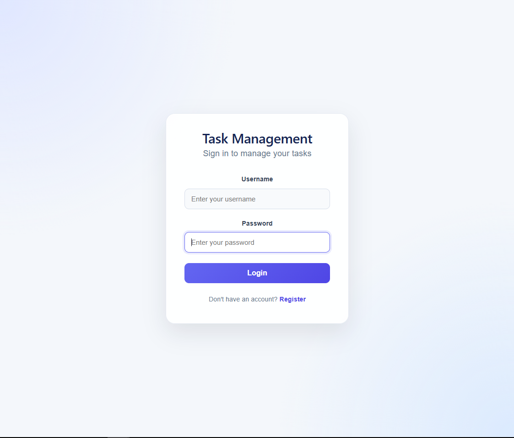
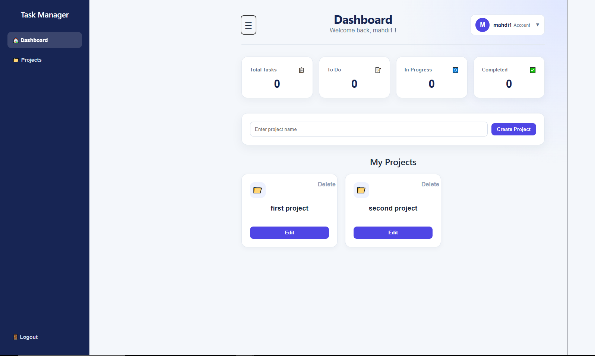
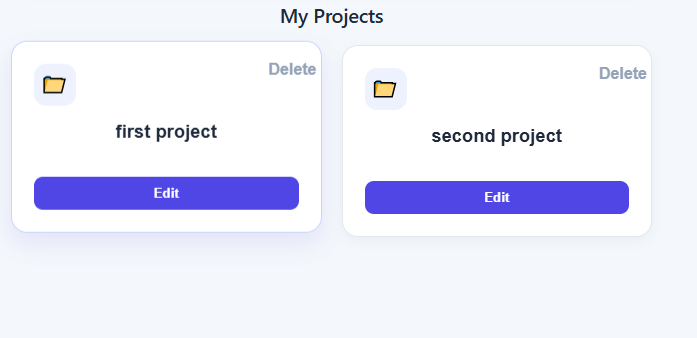
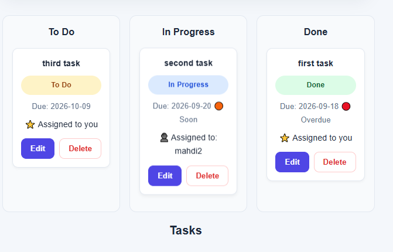
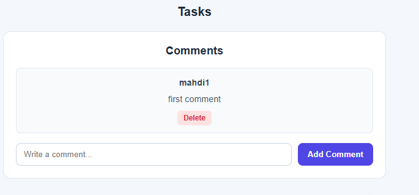
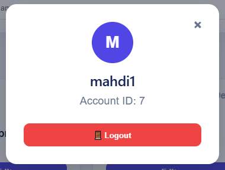

# Task Management Web App

## About The Project

This project is a full-stack Task Management Web Application that I developed as a project to practice and apply web development concepts using React, FastAPI, PostgreSQL, and modern authentication techniques.

The main idea of the application is to provide users with a simple way to create projects, manage tasks, assign tasks to other users, track task progress, and communicate through comments.

During the development of this project, I worked on both the frontend and backend and connected them through REST API endpoints.

---

## Features

The current version of the application includes:

- User registration and login
- JWT-based authentication
- User authorization
- Project creation and deletion
- Task creation, editing, and deletion
- Assign tasks to different users
- Task status management
- Kanban board
- Drag-and-drop task management
- Due-date tracking
- Overdue and upcoming task indicators
- Task comments
- Comment permissions
- Dashboard statistics
- User account/profile section
- Responsive design
- PostgreSQL database persistence

---

## Technologies Used

### Frontend

- React
- JavaScript
- HTML
- CSS

### Backend

- Python
- FastAPI
- SQLAlchemy
- Pydantic
- JWT Authentication

### Database

- PostgreSQL

### Development Tools

- Git
- GitHub
- Visual Studio Code
- PowerShell

---

## System Architecture

The application follows a client-server architecture.

```text
                    React Frontend
                          |
                          | HTTP Requests
                          v
                    FastAPI Backend
                          |
             +------------+------------+
             |            |            |
          Routers       Auth       Schemas
             |            |            |
             +------------+------------+
                          |
                       Models
                          |
                      SQLAlchemy
                          |
                       PostgreSQL
```

### Frontend

The React frontend is responsible for:

- Displaying the user interface
- Managing application state
- Sending HTTP requests to the backend
- Displaying projects and tasks
- Managing the Kanban board
- Handling drag-and-drop
- Displaying and creating comments
- Managing login and logout

### Backend

The FastAPI backend provides the REST API used by the frontend.

The backend is organized into:

- Routers
- Models
- Schemas
- Database configuration
- Authentication and authorization

### Database

PostgreSQL is used to store the application's persistent data.

The main entities are:

```text
User
 |
 +---- Project
 |       |
 |       +---- Task
 |              |
 |              +---- Comment
 |
 +---- Task
```

Users can own projects and be assigned to tasks.

Projects contain tasks, and tasks can contain comments.

---

## Authentication and Authorization

The application uses JWT-based authentication.

After a successful login, the backend generates a JWT token which is used by the frontend when accessing protected endpoints.

```text
User
  |
  v
Login
  |
  v
FastAPI
  |
  v
JWT Token
  |
  v
React Frontend
```

Authentication determines who the user is, while authorization determines whether the user is allowed to perform a specific operation.

For example:

- Users can manage their own projects.
- Users can be assigned to tasks.
- Users can interact with tasks according to the application's authorization rules.
- Comment deletion is restricted according to the user's permissions.

---

## Main Application Pages

### Login and Registration

Users can create an account and log in to the application.

### Dashboard

The dashboard provides an overview of the user's projects and tasks, along with task statistics.

### Projects

Users can create projects and manage the tasks inside them.

### Tasks

Tasks include:

- Task name
- Assigned user
- Status
- Due date
- Editing
- Deletion

### Kanban Board

Tasks are organized into three status columns:

```text
+-----------+---------------+------+
|   To Do   |  In Progress  | Done |
+-----------+---------------+------+
```

Tasks can be moved between columns using drag-and-drop.

### Comments

Users can open a task and add comments.

Comments are stored in the database and remain available after refreshing the application.

---

## Screenshots

### Login and Registration



### Dashboard



### Projects and Tasks



### Kanban Board



### Task Comments



### Account



---

## Project Structure

```text
task-management-web-app/
│
├── backend/
│   ├── main.py
│   ├── database.py
│   ├── models/
│   ├── schemas/
│   ├── routers/
│   └── requirements.txt
│
├── frontend/
│   └── src/
│       ├── App.jsx
│       └── App.css
│
├── screenshots/
│
├── .gitignore
├── .gitattributes
└── README.md
```

---

## Setup Instructions

### 1. Clone the Repository

```bash
git clone https://github.com/mahdialjoharii/-task-management-web-app.git
cd task-management-web-app
```

### 2. Backend Setup

Navigate to the backend:

```bash
cd backend
```

Create a virtual environment:

```bash
python -m venv .venv
```

Activate the virtual environment on Windows:

```powershell
.venv\Scripts\activate
```

Install the required packages:

```bash
pip install -r requirements.txt
```

### 3. Environment Variables

Create a `.env` file inside the `backend` folder.

Add the required database and authentication configuration:

```env
DATABASE_URL=your_postgresql_database_url
SECRET_KEY=your_secret_key
```

The `.env` file should not be committed to GitHub.

### 4. Start the Backend

From the `backend` folder:

```bash
uvicorn main:app --reload
```

### 5. Start the Frontend

Open another terminal and navigate to the frontend:

```bash
cd frontend
```

Install the frontend dependencies:

```bash
npm install
```

Start the React development server:

```bash
npm run dev
```

The terminal will display the local URL of the frontend.

---

## API Documentation

The backend is built with FastAPI, which provides interactive API documentation.

After starting the backend, the documentation is available at:

```text
http://127.0.0.1:8000/docs
```

---

## Database Relationships

The main relationships in the application are:

```text
User 1 -------- * Project

Project 1 ----- * Task

User 1 -------- * Task

Task 1 --------- * Comment

User 1 -------- * Comment
```

These relationships allow the application to track:

- Project ownership
- Task assignment
- Tasks belonging to projects
- Comments belonging to tasks
- Users who created comments

---

## Git and GitHub

I used Git throughout the development of this project to keep track of the different development milestones.

The source code is published on GitHub:

https://github.com/mahdialjoharii/-task-management-web-app

The `main` branch contains the latest version of the project.

---

## Future Improvements

There are several improvements that I plan to add to the project in future versions:

- Dark mode and light mode
- More advanced task filtering and searching
- Notifications for assigned tasks and upcoming due dates
- More improvements to the user profile and account section
- A more complete Projects page
- Replacing browser `window.confirm()` dialogs with custom application modals
- More UI animations and transitions
- Additional Kanban board improvements
- Task priorities
- Better task organization and filtering
- File attachments for tasks
- More detailed project statistics and analytics
- Improved mobile navigation
- Real-time updates between users

---

## Project Status

The current version of the project includes the main required task-management functionality.

I tested the application for:

- Registration and login
- Authentication and authorization
- Projects
- Tasks
- Task assignment
- Kanban drag-and-drop
- Due dates
- Comments
- Multi-user interaction
- Data persistence
- Responsive design
- Input validation

The project is currently available on GitHub and the application is fully functional for the implemented features.